<h1 align="center">Task Management Application - USE CASES</h1>
<h2>System description</h2>

 Proposing the development of a task management application that will allow the users to create multiple task dashboards and each dashboard will have a list of tasks associated with it.

<ol> 
  
  <li>The different dashboards will have different tasks associated with it;</li>
  <li>The dashboard will be either private or public (shared with other users);</li>
  <li>The task will have a name, assigned person, task status, due date and comment section;</li>
  <li>Below the tasks in progress, there will be a sectioned for completed tasks which will be differentiated from the other tasks by being striked through; </li>
  <li>A task will be marked as complete once the checkbox placed in front of each task is marked;</li>
  <li>The system will automatically display the completed task in the section below, will change the status to complete and will strike through the entire line of the associated task; </li>
  <li>Each user will have to register and create a user account in order to use the system; </li>
  <li>The system will be able to pin a specific task dashboard to the top of the list so the user can see it first.</li>
  </ol>
  
  
  ------------------------------- 
<h3>Use Case 1. Create an account user </h3>
<b> Who? What? Why?</b>    
  

<b> Who?</b> As an unregistered user  
<b>What?</b> I want to be able to register myself (sign up) and create a username & password  
<b>Why?</b> So that I can use the system as a registered user, take full advantage of the features available and share tasks with other users  
 
Example: I created a task dashboard (public), added some tasks to it and I want to assign some tasks with other users from the application. 

 
<b>Acceptance Criteria - GIVEN a context, WHEN an event, THEN an outcome</b>  
GIVEN I am an unregistered visitor   
WHEN I select the “Sign Up” button and enter the required information (username/password) 
THEN I will become a registered user in the system

<b> Supporting Models (screen mockups, diagrams, data models, etc) </b>
 

    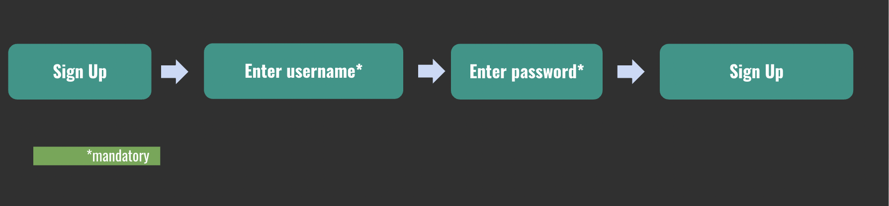
     
  

 

    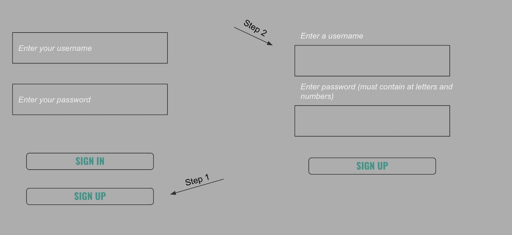
     
  

  
- - - - - - - - - - - - - - - - -
<h3>Use Case 2. Create a task board</h3>
<b> Who? What? Why?</b>  

<b> Who?</b> As a User  
<b>What?</b> I want to be able to create a task board  
<b>Why?</b> So that I can assign different tasks to this board and track the work progress on this particular board (a board can be assigned for a specific customer/account/event/lead/etc) 
 
Example: I have a new potential partner and I’m working on onboarding them as a reseller or technology partner. The onboarding process requires a set of tasks to be completed: sign NDA, sign reseller agreement, send the training links, schedule a demo, schedule introductory call, etc. The purpose of the task board is to be able to keep up with all different aspects of the onboarding process. 

  

 <b>Acceptance Criteria - GIVEN a context, WHEN an event, THEN an outcome</b>  
GIVEN I am a registered user and logged onto the application  
WHEN I select “Create a Task Board” button AND select the privacy type (private/public) AND select “Create Board” button  
THEN I can see a task board added to the main view page. 

  <b> Supporting Models (screen mockups, diagrams, data models, etc) </b>
  

    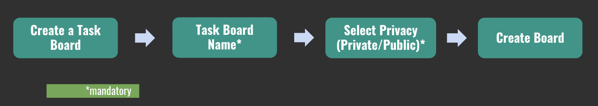
     
  

  
I imagine the final task board to have a look similar to the below: 

  

    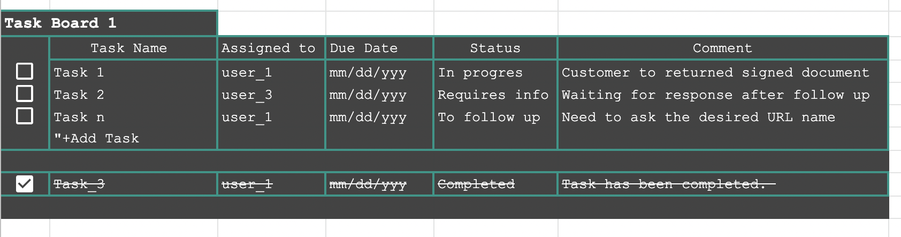
     
  
  
- - - - - - - - - - - - - - - - -
<h3>Use Case 3. Assign tasks to an existing Task Board  </h3>
<b>Who? What? Why?</b>

<b> Who?</b> As a User   
<b>What?</b> I want to be able to add different tasks to a task board   
<b>Why?</b> So that I can add all the action items needed to be done regarding a specific account/project/lead/subject until the completion of all tasks and closure of the task board.   

<b> Acceptance Criteria - GIVEN a context, WHEN an event, THEN an outcome </b>   
GIVEN I have an already created Task Board   
WHEN I select “Add Task” button   
THEN I can edit the Task Name field and give the task a name, assign a person for the task, select a due date (optional), assign a status.  

 <b>Supporting Models (screen mockups, diagrams, data models, etc) </b>

  
  

    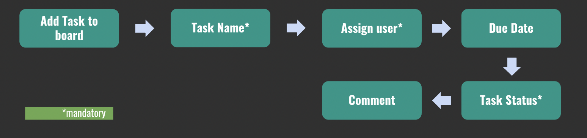 

     
    
 

    
     
  
 

    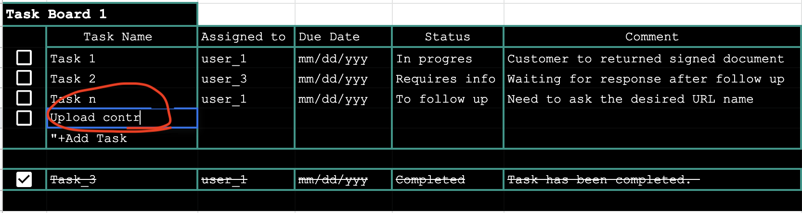 
     
        
   
  - - - - - - - - - - - - - - - - -
<h3>Use Case 4. Mark task as Completed  </h3>

 
<b>Who? What? Why?</b>   
<b> Who?</b> As a User  
<b>What?</b> I want to be able to mark a task as completed by ticking the checkbox (☑) and list the task in a section below the remaining tasks and marking it with a strike-through as seen in the pictures above  
<b>Why?</b> So that I can visually observe the progress of the task board.  

 

<b>Acceptance Criteria - GIVEN a context, WHEN an event, THEN an outcome</b>  
GIVEN I have an already created Task Board   
WHEN I tick the check box in front of the task (☑)   
THEN the subject task will be listed in a section below with a strike-through and the status on this task will automatically be “completed”.   

<b>Supporting Models (screen mockups, diagrams, data models, etc)</b> 

 

    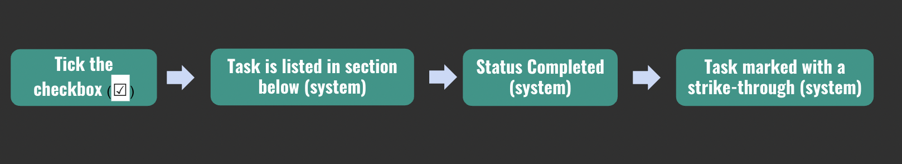 
     
  
  

    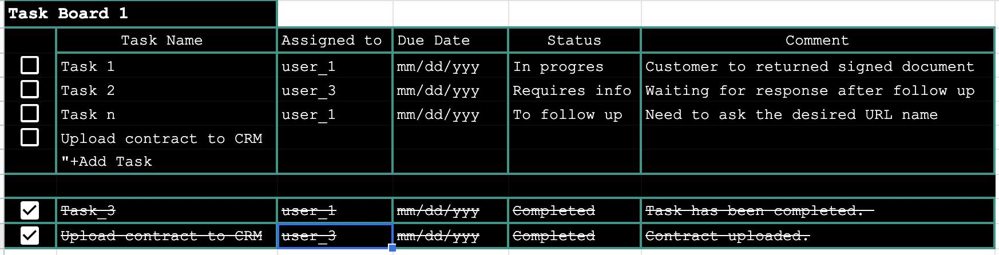 
     
  
 - - - - - - - - - - - - - - - - - 
<h3>Use Case 5. Send a notification about a task to another user  </h3> 

 
<b>Who? What? Why?</b>   
<b> Who?</b> As a registered user  
<b>What?</b> I want to be able to send a notification about a certain task to another user  
<b>Why?</b> So that I can keep the other users informed on what is on their task list

   

<b>Acceptance Criteria - GIVEN a context, WHEN an event, THEN an outcome</b>  
GIVEN I have an already created public Task Board  and added a task assigned to user X  
WHEN I select the ፧ symbol, I select the “Notify User” option  
THEN The user X will be notified via Gmail about this specific task that is waiting for him/her in the public Task Board  

<b>Supporting Models (screen mockups, diagrams, data models, etc)</b> 

    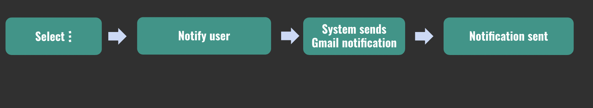 
     
  
  

    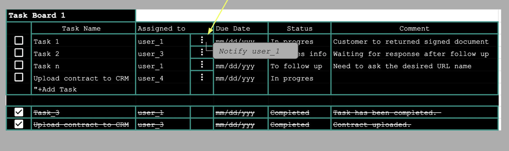 
     

   
- - - - - - - - - - - - - - - - -
  <h3> Use Case Diagrams </h3> 
   

    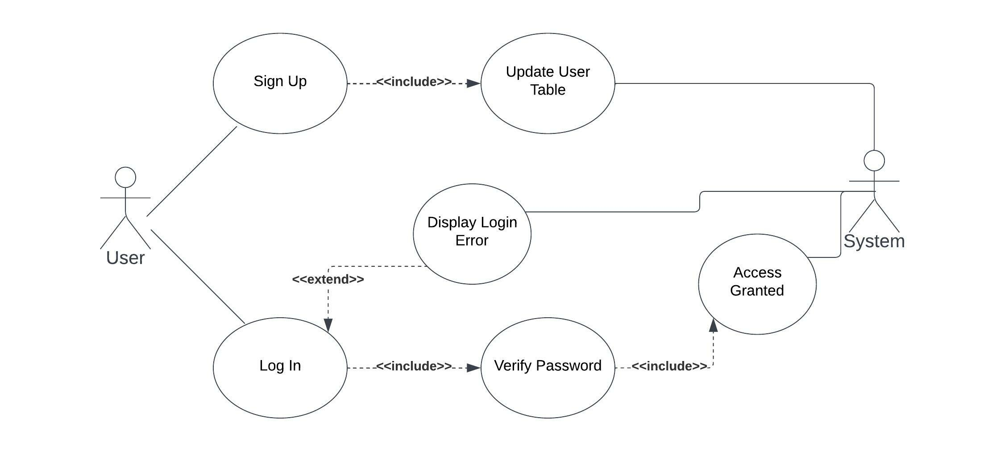 
    

    
  
  

    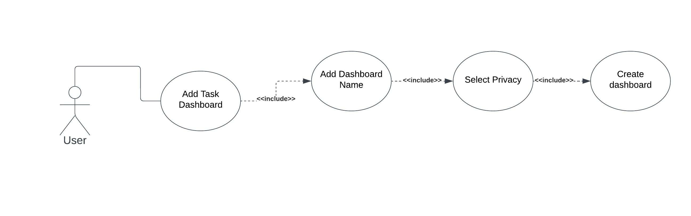 
    

 

     
    

    
 

 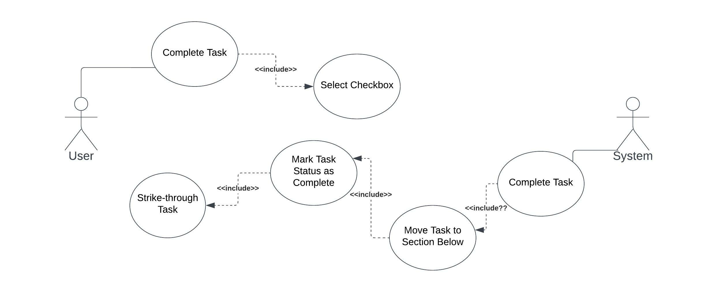 
 

  
